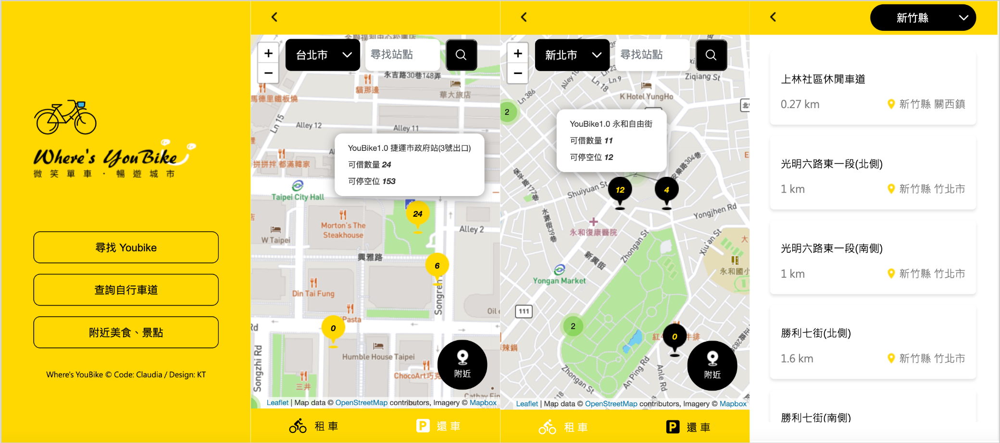

# 作品說明

The F2E 自行車道地圖資訊整合網

- 搜尋指定縣市、附近Youbike站可借/可停數量
- 搜尋指定縣市自行車道
- 搜尋附近景點、美食
- 三種功能皆可以地圖檢視
- 手機、平板、電腦皆可使用

Data source: [TDX 運輸資料流通服務](https://tdx.transportdata.tw/)

Design: [KT](https://www.behance.net/KT_Designer)

# 系統說明
專案運行方式：ng serve

網站連結：https://claudia-teng.github.io/tw-bicycle-map/

# 資料夾說明

src/app:
- auth：利用intercepter處理http request header
- components：主要分為 index（首頁）, youbike-stop（Youbike）, bicycle-lane（自行車道）, nearby-place（附近景點、美食）
- model：存放所有interface
- service：存放所有service

# 使用技術

- Angular
- Sass
- PrimeNG
- CSS Flexbox
- RWD

# 第三方服務

- Leaflet.js

